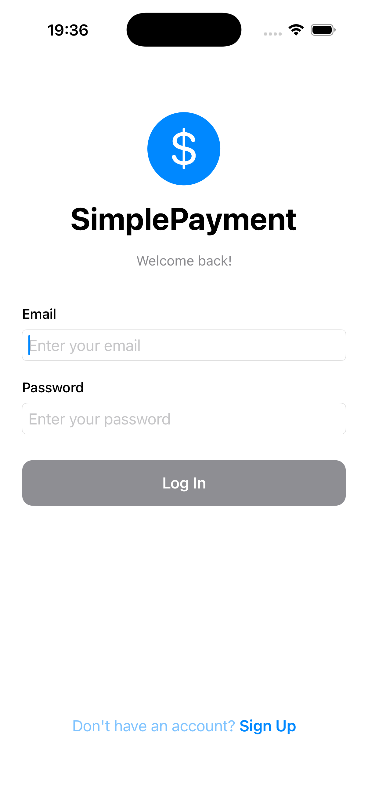
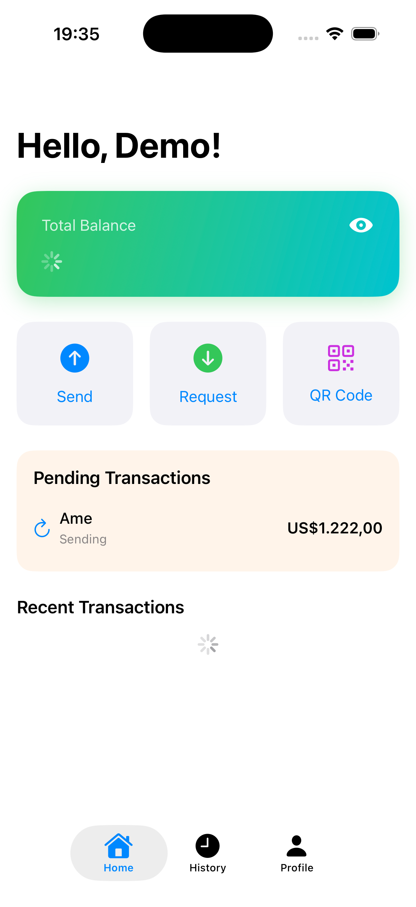
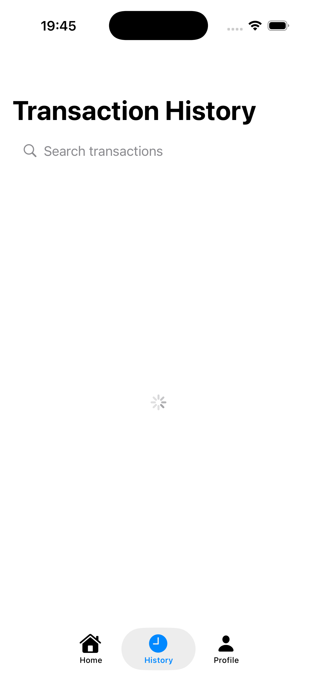
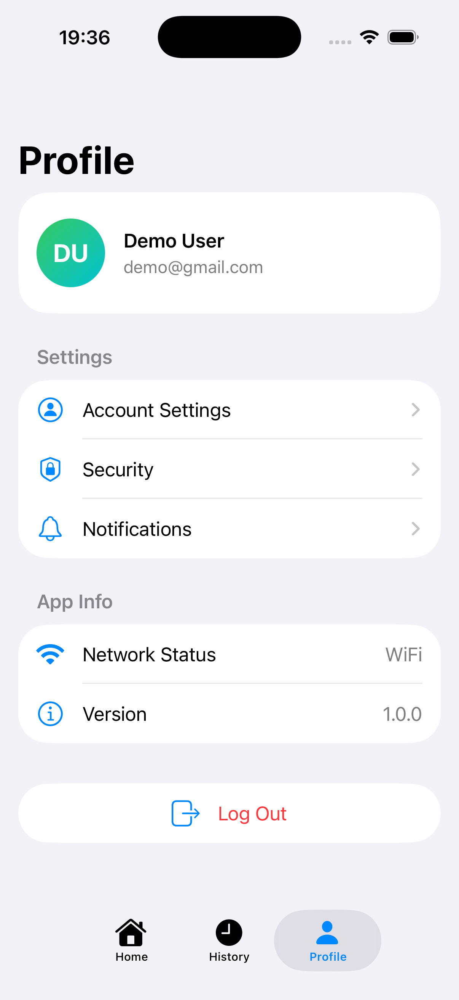

# 💳 SimplePayment

[](https://swift.org)
[](https://www.apple.com/ios)
[](https://developer.apple.com/xcode/swiftui/)
[](LICENSE)

A secure, offline-first mobile payment application built with SwiftUI, optimized for low-bandwidth environments and designed to handle 1M+ concurrent users.

---

## 📱 Overview

SimplePayment is a production-ready iOS payment application that enables instant P2P money transfers with enterprise-grade security features. Built with a focus on:

- **🔒 Security First**: Comprehensive jailbreak detection, SSL pinning, and encrypted storage
- **📡 Offline-First**: Queue transactions locally and sync when connected
- **🚀 Performance**: Two-layer caching and optimized for 2G/3G networks
- **⚡️ Real-time**: Instant transaction processing with network monitoring

---

## 📸 Screenshots

<p align="center">
  
  
  
  
</p>

<p align="center">
  <em>Login Screen • Home Dashboard • Transaction History • Profile</em>
</p>

---

## ✨ Key Features

### Security Features

- **Jailbreak Detection** (8+ detection methods)
  - Suspicious files and apps detection
  - System directory write tests
  - Fork() availability checks
  - Symbolic link detection
  - Environment variable inspection
- **Feature Restrictions**: Automatically restrict sensitive operations on compromised devices
- **Secure Storage**: AES-256 encrypted Keychain storage
- **SSL Pinning**: Certificate validation (ready to implement)
- **Request Signing**: HMAC-SHA256 authentication
- **Auto-logout**: Session management with token refresh

### Payment Features

- **Send Money**: Instant P2P transfers
- **Receive Money**: Real-time notifications
- **Transaction History**: View all transactions with filtering
- **Wallet Management**: Balance tracking and updates
- **Offline Queue**: Queue transactions when offline, auto-sync on connection

### Performance Optimizations

- **Two-layer Caching**: In-memory (fast) + Disk (persistent)
- **Request Compression**: gzip encoding (60-80% data reduction)
- **Background Sync**: BGTaskScheduler for offline transactions
- **Adaptive Quality**: Automatic quality adjustment based on network
- **Lazy Loading**: Smooth scrolling with SwiftUI lazy stacks
- **Pagination**: 20 items per page for efficient data loading

---

## 🚀 Quick Start

### Prerequisites

- macOS 13.0 or later
- Xcode 15.0 or later
- iOS 16.0+ deployment target
- Swift 5.9+

### Installation

1. **Clone the repository**
   ```bash
   cd /path/to/SimplePayment
   ```

2. **Open in Xcode**
   ```bash
   open SimplePayment.xcodeproj
   ```

3. **Build and Run**
   - Select a simulator or device
   - Press `⌘ + R` to build and run

4. **Login with Demo Mode**
   ```
   Email: demo@example.com
   Password: password123
   ```
   (Or ANY email/password combination in mock mode!)

---

## 🎮 Demo Mode

The app includes a **Mock Mode** for testing without a backend API.

### Current Status: ✅ Demo Mode Active

**Any email/password combination will work!**

```swift
// AuthViewModel.swift:18
private let useMockMode = true  // Currently enabled
```

### What Works in Demo Mode:
- ✅ Login with any credentials
- ✅ Register new users
- ✅ View profile
- ✅ Navigate through app
- ✅ Logout

### What Requires Backend:
- ⚠️ Wallet shows $0.00 balance
- ⚠️ Cannot send/receive money
- ⚠️ No real transaction history
- ⚠️ No push notifications

### Switch to Production Mode:

**Step 1:** Disable mock mode
```swift
// AuthViewModel.swift:18
private let useMockMode = false
```

**Step 2:** Configure API endpoint
```swift
// APIClient.swift
private let baseURL = "https://your-api.com/v1"
```

See [`DEMO_CREDENTIALS.md`](DEMO_CREDENTIALS.md) for detailed testing guide.

---

## 🏗️ Architecture

### Design Pattern: MVVM + Clean Architecture

```
SimplePayment/
├── App/
│   ├── SimplePaymentApp.swift       # App entry point
│   └── ContentView.swift            # Root navigation
├── Core/
│   ├── Network/
│   │   ├── NetworkMonitor.swift     # Connectivity monitoring
│   │   ├── APIClient.swift          # HTTP client with retry
│   │   └── Endpoints.swift          # API endpoints
│   ├── Storage/
│   │   ├── SecureStorage.swift      # Keychain wrapper
│   │   └── CacheManager.swift       # Two-layer cache
│   └── Security/
│       ├── JailbreakDetector.swift  # Jailbreak detection
│       └── SecurityManager.swift    # Security state management
├── Models/
│   ├── User.swift                   # User model
│   ├── Transaction.swift            # Transaction model
│   ├── Wallet.swift                 # Wallet model
│   └── TransactionError.swift       # Error handling
├── ViewModels/
│   ├── AuthViewModel.swift          # Authentication logic
│   └── WalletViewModel.swift        # Wallet logic
├── Services/
│   └── TransactionService.swift     # Transaction handling
└── Views/
    ├── Auth/
    ├── Home/
    ├── Wallet/
    └── Components/
        ├── NetworkStatusBanner.swift
        └── SecurityWarningBanner.swift
```

### Key Technologies

- **SwiftUI**: Declarative UI framework
- **Combine**: Reactive programming
- **async/await**: Modern concurrency
- **Keychain Services**: Secure storage
- **Network Framework**: Connectivity monitoring
- **URLSession**: HTTP networking

---

## 🔐 Security Implementation

### Jailbreak Detection

SimplePayment includes comprehensive jailbreak detection with **8+ methods**:

#### Detection Methods

1. **Suspicious Files** (`JailbreakDetector.swift:40`)
   - Checks for Cydia, Sileo, Zebra package managers
   - Detects jailbreak tools (blackra1n, FakeCarrier, etc.)
   - Looks for Mobile Substrate dylibs
   - Searches for SSH and system tools

2. **Suspicious Apps** (`JailbreakDetector.swift:107`)
   - Tests URL schemes: `cydia://`, `sileo://`, `zbra://`, `filza://`

3. **System Directory Writable** (`JailbreakDetector.swift:130`)
   - Attempts to write to `/private/` (should fail on non-jailbroken devices)

4. **Cydia URL Scheme** (`JailbreakDetector.swift:146`)
   - Specific check for Cydia package manager

5. **Fork() Test** (`JailbreakDetector.swift:157`)
   - Tests if `fork()` system call succeeds (restricted on iOS)

6. **Symbolic Links** (`JailbreakDetector.swift:173`)
   - Checks for suspicious symlinks in system directories

7. **Environment Variables** (`JailbreakDetector.swift:203`)
   - Detects `DYLD_INSERT_LIBRARIES`, `_MSSafeMode`, `_SafeMode`

8. **Suspicious Paths** (`JailbreakDetector.swift:224`)
   - Additional system path checks with read tests

#### Jailbreak Actions

When jailbreak is detected, the app can take different actions:

```swift
enum JailbreakAction {
    case block      // Completely block the app
    case warn       // Show warning but allow usage
    case restrict   // Allow basic usage but restrict features (RECOMMENDED)
    case log        // Just log, don't interfere
}
```

**Current Configuration**: `.restrict` mode in production

#### Feature Restrictions

On jailbroken devices, the following features are automatically restricted:

- ❌ **Sending money**
- ❌ **Withdrawing funds**
- ❌ **Adding bank accounts**
- ✅ **View balance** (allowed)
- ✅ **View transactions** (allowed)
- ✅ **Update profile** (allowed)

Check restrictions in code:
```swift
// TransactionService.swift:44
guard SecurityManager.shared.isFeatureAllowed(.sendMoney) else {
    throw TransactionError.featureRestricted(...)
}
```

#### Security Warning Banner

The app displays a dismissible warning banner when jailbreak is detected:

- Shows at the top of the screen
- Explains why device is flagged
- Lists restricted features
- Can be expanded for more details
- Styled based on action severity (red for restrict, orange for warn)

### Other Security Features

- **Secure Storage**: All sensitive data stored in Keychain with `kSecAttrAccessibleAfterFirstUnlockThisDeviceOnly`
- **Request Signing**: HMAC-SHA256 signatures on API requests (ready to implement)
- **Auto-logout**: Automatic session timeout after inactivity
- **Token Refresh**: JWT refresh tokens for extended sessions

---

## 📡 Offline-First Architecture

### How It Works

1. **Transaction Queue**: All transactions saved locally first
2. **Optimistic Updates**: UI updates immediately for responsiveness
3. **Background Sync**: Auto-sync when network returns
4. **Idempotency**: Each transaction has unique ID to prevent duplicates
5. **Persistent Storage**: Queue saved to Keychain for app restart recovery

### Network Monitoring

Real-time network quality detection:

```swift
enum ConnectionQuality {
    case excellent  // WiFi, 4G, 5G
    case good       // 3G
    case poor       // 2G, EDGE
    case unknown
}
```

### Transaction Flow

```
User taps "Send Money"
    ↓
Create transaction locally → Save to queue
    ↓
Update UI (optimistic)
    ↓
If online: Sync to server → Mark completed → Remove from queue
If offline: Keep in queue → Auto-sync when connected
```

---

## 🚀 Performance

### Optimization Strategies

#### 1. Two-Layer Caching

**Memory Cache** (L1 - Fast):
- In-memory dictionary
- Instant access
- Cleared on memory warnings

**Disk Cache** (L2 - Persistent):
- JSON files in `Caches` directory
- Survives app restarts
- Auto-promotes to memory on hit

```swift
// Cache for 30 minutes
await CacheManager.shared.set(data, for: key, ttl: 1800)

// Retrieve (checks memory → disk)
let data = await CacheManager.shared.get(key, as: Type.self)
```

#### 2. Request Compression

All API requests use gzip compression:
- **60-80% smaller** payloads
- Faster transfers on slow networks
- Automatic decompression

#### 3. Background Sync

Uses `BGTaskScheduler` for:
- Syncing pending transactions
- Updating wallet balance
- Fetching new transactions
- All happens in background without user intervention

#### 4. Pagination

Lists paginated at 20 items per page:
- Reduces initial load time
- Smooth infinite scrolling
- Lower memory footprint

---

## 🛠️ API Integration

### Endpoints

| Method | Endpoint | Description |
|--------|----------|-------------|
| POST | `/auth/login` | User login |
| POST | `/auth/register` | User registration |
| POST | `/auth/refresh` | Refresh access token |
| GET | `/wallet/balance` | Get wallet balance |
| POST | `/transactions/send` | Send money |
| GET | `/transactions` | Fetch transaction history |
| GET | `/transactions/:id` | Get transaction details |

### Request Format

```swift
struct SendMoneyRequest: Codable {
    let recipientId: String
    let amount: Decimal
    let currency: String
    let note: String?
    let idempotencyKey: String  // Prevents duplicates
}
```

### Response Format

```swift
struct TransactionResponse: Codable {
    let transaction: Transaction
    let sender: User
    let recipient: User
    let wallet: Wallet  // Updated balance
}
```

### Error Handling

All API errors conform to:

```swift
struct APIError: Codable {
    let code: String        // e.g., "INSUFFICIENT_BALANCE"
    let message: String     // Human-readable message
    let details: [String: Any]?
}
```

See [`BACKEND_ARCHITECTURE.md`](../BACKEND_ARCHITECTURE.md) for complete API documentation.

---

## 🧪 Testing

### Manual Testing (Demo Mode)

1. Launch app
2. Login with any credentials
3. Navigate tabs
4. Test offline mode (enable Airplane Mode)
5. View cached data
6. Disable Airplane Mode to see auto-sync

### Unit Tests (TODO)

```bash
# Run all tests
xcodebuild test -scheme SimplePayment -destination 'platform=iOS Simulator,name=iPhone 15'
```

### Test Coverage Goals

- [ ] AuthViewModel: 90%+
- [ ] TransactionService: 90%+
- [ ] CacheManager: 85%+
- [ ] JailbreakDetector: 80%+

---

## 🐛 Troubleshooting

<details>
<summary><strong>Login doesn't work</strong></summary>

**Check:**
- Ensure `useMockMode = true` in `AuthViewModel.swift:18`
- Any email/password should work in mock mode
- Check console for error messages

**Fix:**
```swift
// AuthViewModel.swift:18
private let useMockMode = true  // Must be true for demo
```
</details>

<details>
<summary><strong>Wallet shows $0.00</strong></summary>

**Reason:** Mock mode doesn't populate wallet data by default

**Fix:** Add mock wallet data (see `DEMO_CREDENTIALS.md`)
```swift
// WalletViewModel.swift
func loadBalance() async {
    if useMockMode {
        self.wallet = Wallet(
            userId: "demo-user-123",
            balance: 1250.50,
            availableBalance: 1250.50,
            frozenBalance: 0
        )
        return
    }
    // ... real API call
}
```
</details>

<details>
<summary><strong>Can't send money on jailbroken device</strong></summary>

**Reason:** Security restrictions automatically enabled

**Check:**
```swift
// SecurityManager.swift
if SecurityManager.shared.isJailbroken {
    // Sending money is restricted in .restrict mode
}
```

**To override (NOT RECOMMENDED for production):**
```swift
// SecurityManager.swift:29
self.securityAction = .log  // Change from .restrict to .log
```
</details>

<details>
<summary><strong>Build errors about missing modules</strong></summary>

**Fix:**
1. Clean build folder: `⌘ + Shift + K`
2. Delete derived data:
   ```bash
   rm -rf ~/Library/Developer/Xcode/DerivedData
   ```
3. Rebuild: `⌘ + B`
</details>

<details>
<summary><strong>Network requests failing</strong></summary>

**Check:**
- Is mock mode enabled? (should accept any request)
- Is API URL correct in `APIClient.swift`?
- Check Info.plist for `NSAppTransportSecurity` settings

**Enable network debugging:**
```swift
// APIClient.swift
let urlSession = URLSession(configuration: {
    let config = URLSessionConfiguration.default
    config.timeoutIntervalForRequest = 30
    config.waitsForConnectivity = true
    return config
}())
```
</details>

---

## 📚 Documentation

- [`README.md`](README.md) - This file
- [`DEMO_CREDENTIALS.md`](DEMO_CREDENTIALS.md) - Testing guide and credentials
- [`IOS_APP_ARCHITECTURE.md`](../IOS_APP_ARCHITECTURE.md) - Detailed app architecture
- [`IOS_APP_SECURITY.md`](../IOS_APP_SECURITY.md) - Security implementation guide
- [`BACKEND_ARCHITECTURE.md`](../BACKEND_ARCHITECTURE.md) - Backend API specifications
- [`MVP_iOS_3MONTH_ROADMAP.md`](../MVP_iOS_3MONTH_ROADMAP.md) - Development roadmap
- [`QUICKSTART.md`](QUICKSTART.md) - Quick setup guide (if exists)

---

## 🗺️ Roadmap

### Version 1.0 (Current) ✅
- [x] Authentication (login/register/logout)
- [x] Wallet management
- [x] Basic send money flow
- [x] Transaction history
- [x] Offline-first architecture
- [x] Network monitoring
- [x] Two-layer caching
- [x] Jailbreak detection
- [x] Security warning UI
- [x] Feature restrictions

### Version 1.1 (Next)
- [ ] Biometric authentication (Face ID/Touch ID)
- [ ] Push notifications
- [ ] Transaction filters and search
- [ ] Export transaction history
- [ ] Dark mode support
- [ ] Localization (multi-language)

### Version 1.2
- [ ] QR code scanning for payments
- [ ] Contact integration
- [ ] Recurring payments
- [ ] Split bills feature
- [ ] Request money feature

### Version 2.0
- [ ] Multi-currency support
- [ ] Bank account linking
- [ ] Bill payments
- [ ] Merchant payments
- [ ] Analytics dashboard

---

## 🤝 Contributing

Contributions are welcome! Please follow these steps:

1. Fork the repository
2. Create a feature branch: `git checkout -b feature/amazing-feature`
3. Commit your changes: `git commit -m 'Add amazing feature'`
4. Push to the branch: `git push origin feature/amazing-feature`
5. Open a Pull Request

### Code Style

- Follow [Swift API Design Guidelines](https://swift.org/documentation/api-design-guidelines/)
- Use SwiftLint for linting (if configured)
- Write meaningful comments for complex logic
- Keep functions small and focused

### Commit Messages

Format: `<type>(<scope>): <subject>`

Types:
- `feat`: New feature
- `fix`: Bug fix
- `docs`: Documentation changes
- `refactor`: Code refactoring
- `test`: Adding tests
- `chore`: Maintenance tasks

Example: `feat(auth): add biometric authentication support`

---

## 📄 License

This project is licensed under the MIT License - see the [LICENSE](LICENSE) file for details.

---

## 💬 Support

For questions, issues, or feature requests:

- **Issues**: [GitHub Issues](https://github.com/yourusername/SimplePayment/issues)
- **Discussions**: [GitHub Discussions](https://github.com/yourusername/SimplePayment/discussions)
- **Email**: support@simplepayment.com

---

## 👏 Acknowledgments

- Built with ❤️ using SwiftUI
- Inspired by modern payment apps like OKX, Binance, and Cash App
- Icons from SF Symbols

---

**Happy Coding! 🎉**

Made with 💳 by the SimplePayment Team
